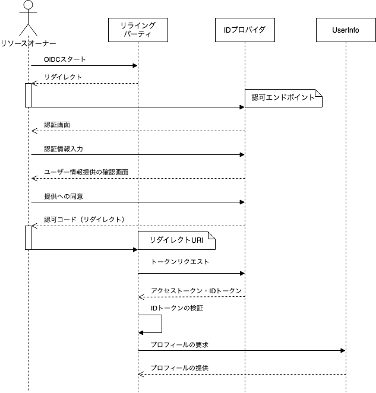
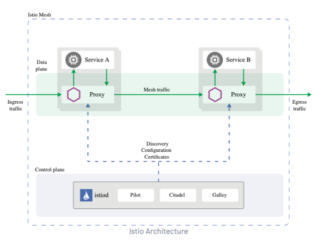

# 認証と認可
認証：「お前誰？」\
認可：「君の素性はわかった、しかし許可は持っているのか？」 \

### HTTTPレスポンスでの違い
- 401 Unauthorized → 認証失敗　「君誰ですのん」
- 403 Forbidden → 認可の不足　　「素性はわかっておるが、許可できん」

## SAML
SAMLとは、Security Assertion Markup Language の略で、\
標準化団体 OASIS によって策定された、XML をベースにした異なるインターネットドメイン間でユーザー認証を行うための標準規格。\
一度のログインで複数のサービスにログインできる SSO を実現するために活用される。

### SAML 認証の登場人物
SAML認証では、ユーザー・IdP・SP の三者間で認証情報をやり取りします。
- ユーザー
  利用者。主にブラウザを用いてやり取りする。
- IdP
  Identity Providerの略。SSOの仕組みを提供するサービスを指す。
- SP
  Service Providerの略。ログインしたいクラウドサービスを指す。

### 認証の流れ
SAML認証には２パターンの流れがある。
#### SP Initiated
SPを起点とした認証の流れ。

1. ユーザーが SP にアクセスする
2. SP がSAML認証要求を作成し、ユーザーに応答する
3. ユーザーは SP から受け取ったSAML認証要求を IdP に送信する
4. IdP の認証画面が表示される
5. ユーザーは認証情報を入力して IdP との間で認証処理を行なう
6. 認証が成功すると、IdP からSAML認証応答が発行される
7. ユーザーは IdP から受け取ったSAML認証応答を SP に送信する
8. SP にSAML認証応答が届くとログインができる

#### Idp Initiated
IdPを起点とした認証の流れ。 \
https://qiita.com/taka-k/items/785d1be8725f76f3bad9

[SAML認証の仕組みと認証フロー](https://tech-blog.rakus.co.jp/entry/20230301/saml)

## Open ID Connect (OIDC)
OIDCは、OAuth 2.0フレームワークの上に構築されています。\
OIDCは、JSONベースのWebトークン（JWT）を使用してデータを構造化します。\
JWTは、両者の間でクレームを表して安全に転送するためのルールを定義する業界標準です。\
クレームとは、IDの管理と検証をサポートするために使用される、暗号化された機密性の高いユーザデータと考えてください。\
トランスポートのために、OIDCはデフォルトのHTTPSフローを使用します。

### OAuthによる認証の問題点
アクセストークンにはクライアントを確認するための仕組みがありません。つまり誰宛に発行したアクセストークンなのかに関わらず、リソースサーバーはリソースを返してしまうということです。このため、クライアントが悪意あるクライアントであった場合、上記のフローで取得した他人のアクセストークンを使って、OAuth認証を採用している任意のサイトになりすましログインが可能となってしまいます。

OpenID ConnectではIDトークンというものを用いてこの問題に対処しています。

### IDトークン
JWT（JSON Web Tokenの略）という形式でIDプロバイダから発行される。\
IDトークンには、ユーザー識別子、IDトークンの発行元、発行先などの情報が含まれるため、これらの情報が改竄されていないことを確認するために署名が含まれています。\
OAuth認証と比べて、IDトークンの仕組みによって、ユーザー識別子、IDトークンの発行元、発行先などの情報が含まれているため、これらを適切に検証することでユーザーのなりすましを防ぐことができます。

### OpenID Connectの登場人物
| OAuth            | OpenID Connect         |
| ---------------- | ---------------------- |
| リソースオーナー | エンドユーザー         |
| クライアント     | RP(リライングパーティ) |
| 認可サーバー     | IdP(IDプロバイダ)      |
| リソースサーバー | UserInfoエンドポイント |

### 認可フロー

#### 参考
https://kouki.hatenadiary.com/entry/2023/01/08/000000

# サービスメッシュ
サービスメッシュは、以下のようなアプリケーションレベルの通信をアプリケーション自身が制御するのではなく、インフラストラクチャ側で制御できるようにする技術です。
- HTTP 通信のリトライやタイムアウト
- 通信のトレーシングやログ、メトリクスの取得
- TLS を使用した暗号化通信

マイクロサービス間の通信処理はアプリケーション側では実装せずに、インフラストラクチャ側で一括管理をしてしまおう、といった考え方です。これを実現する技術を、サービスメッシュといいます。そうすれば各チームはアプリケーションの開発だけに注力することができ、通信処理の部分に関してはインフラストラクチャ側に任せれば済むようになります。

## 仕組み
Kubernetes を使った実装では、アプリケーションコンテナは論理上 pod の中に存在しています。アプリケーションから通信処理に関する部分だけを分離するには、この pod の中に別のコンテナを組み込みます。これはプロキシコンテナと言われるもので、マイクロサービス間の通信を制御するのに特化したプロキシとなります。このようにすることで、これまではアプリケーション側で実装が必要だった通信処理の役割を、代わりにプロキシが担うようになります。

プロキシコンテナは、特定の pod だけではなく Kubernetes クラスターに存在する全ての pod に挿入されます。そうすると、各 pod が他の pod と通信を行う際はプロキシを通じて行うことになり、その様子が網の目 (メッシュ) のように張り巡らされます。これがサービスメッシュと言われる所以です。また、プロキシコンテナは全てのアプリケーションコンテナに付随してデプロイされるため、サイドカーコンテナとも呼ばれます。

サービスメッシュでは全ての pod 内にプロキシを実装しており、そのため pod 間で発生する通信は必ずプロキシを経由することになります。通信制御をプロキシに任せることで、アプリケーション側での開発負担が大幅に削減されます。

# Renovateによる依存関係のバージョン更新
https://qiita.com/yukin01/items/497978159440627c038a

