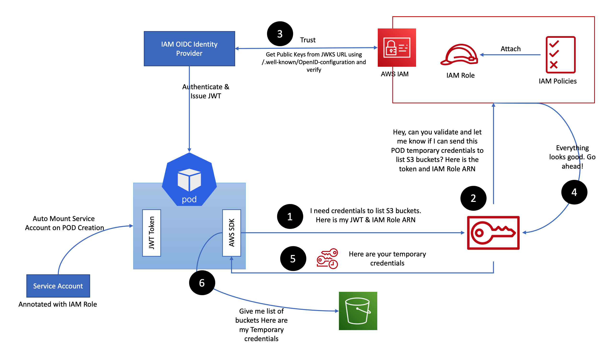
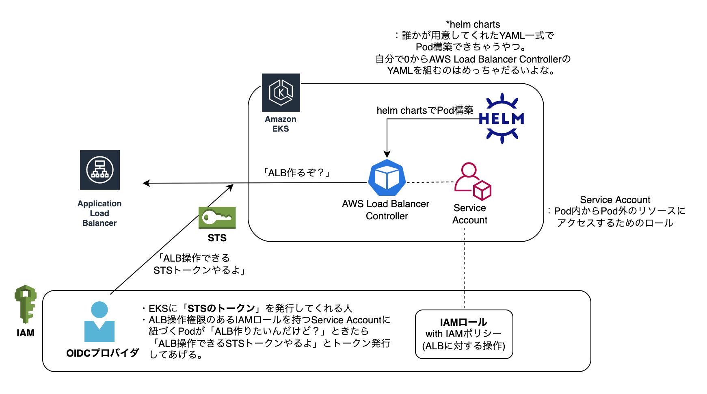
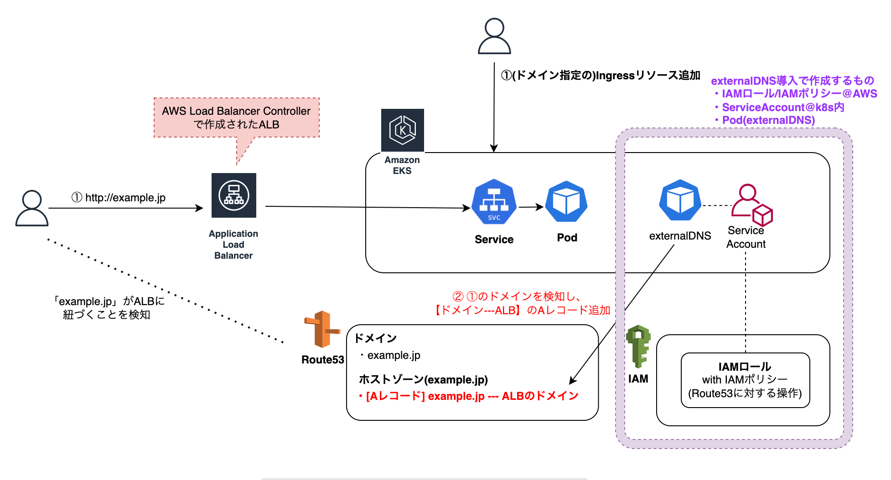
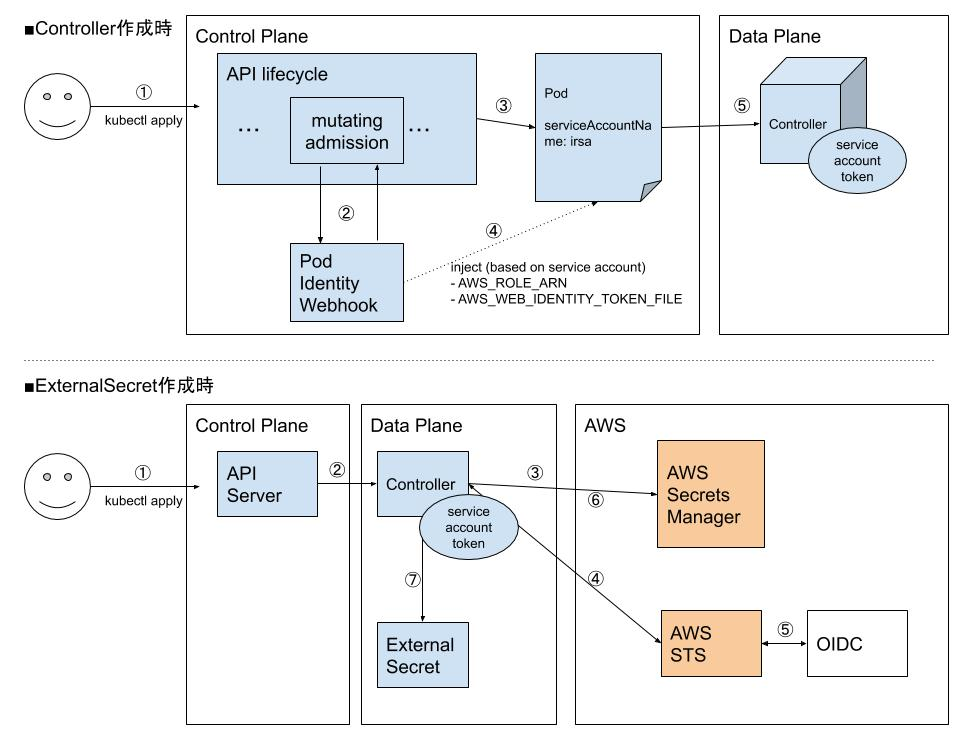

# Kubernetes導入理由
https://blog.howtelevision.co.jp/entry/2021/11/12/113000 \
- コンテナの振る舞いをマニフェストで記述したうえGitで管理できる
- マニフェストで定義した振る舞いをシンプルに展開できる、リソースコントロールを柔軟にできる、スケーリングが容易にできる
- 強力なエコシステムの恩恵を受けることができる
- 特定のベンダーに依存せず、オープンなものに依存することで拡張性を得ることができる
### 環境ごとのクラスター構成
本番環境稼働・検証環境・開発環境でKubernetesクラスターを分けています。 \
これにより検証環境では、本番環境と同等な状態でのアプリケーションの動作確認と負荷試験の結果を受けたキャパシティプランニングができる \
namespaceで本番環境・検証環境・開発環境を分離する方法も検討しましたが、クラスタ自体が分離されているほうがテストをしやすく、本番環境だけの特別な操作という心理的な負担を減らすことができる
### マニフェスト管理はシンプルに
kustomizeを利用することで環境差分を吸収して、1つのリポジトリで全マニフェストを管理する方法をとっています。 Helmはより柔軟にパラメータの指定ができますが、学習コストが高くマニフェスト管理への障壁になる点

# マネージド型ノードグループ
EKS クラスターに計算能力を提供する基盤となる Amazon EC2 インスタンスも、Amazon EKS がプロビジョニングおよび管理するようになり、Kubernetes バージョンの更新などの運用作業をさらにシンプルに
https://docs.aws.amazon.com/ja_jp/eks/latest/userguide/managed-node-groups.html
https://aws.amazon.com/jp/blogs/news/amazon-eks-and-spot-instances-in-action-at-delivery-hero/
### EC2 スポットインスタンス
https://aws.amazon.com/jp/ec2/spot/ \
Kubernetesワーカーノードのコストを最大90%削減可能。
複数のインスタンスタイプのリストを提供し、マネージド型ノードグループに設定するインスタンスタイプを多様化して、ノードグループが複数のキャパシティプールを利用できるようにする
ノードグループ内のSpotインスタンスの1つの中断のリスクが高まり、EC2インスタンスのリバランス通知を受け取ると、EC2 Auto Scaling グループは代替インスタンスを起動しようとします。より多くのインスタンスタイプをマネージド型ノードグループに設定しておくことで、EC2 Auto Scaling が代替のSpotインスタンスを直ちに起動し、中断を安全に処理できる可能性が高まります。

# Kubernetesを中心としたコンテナエコシステムの環境構築や運用ノウハウ
https://developer.mamezou-tech.com/container/

# Kubernetesクラスタを構築
### PodレベルのAWSリソースへのアクセス許可(IRSA:IAM Roles for Service Accounts)
[詳解: IAM Roles for Service Accounts](https://aws.amazon.com/jp/blogs/news/diving-into-iam-roles-for-service-accounts/) \
k8sクラスターからAWSリソースを利用する場合、セキュリティ上IAMで必要最小限のアクセスに制限するのが望ましいです。\
ワークロードがAWS認証情報を見つけられない場合にEC2インスタンスプロファイルがデフォルトとされる動作だが最小権限の原則に反する。\
EKSではIRSA(IAM Roles for Service Account)という仕組みが用意されており、Podの単位でIAM Roleを割り当てることが可能です

1. AWSリソースに対してCRUD可能なポリシードキュメントを定義
2. IAM Policy(xxxxxxPolicy)を作成
3. IAM PolicyをアタッチするIAM Roleを作成(TerraformのIAMモジュール使用)。\
    このRoleの引受可能な対象にKubernetesのServiceAccount(system:serviceaccount:${var.env}:xxxxxx)を指定
4. IAM Roleを指定に紐づくServiceAccountを作成

# Ingress導入
### Service (type: LoadBalancer)リソースの場合
ServiceリソースをLoadBalancerとして定義することでL4ロードバランサーを作成(実態はELB)しました。\
この方法はシンプルですが、ルーティング機能が貧弱(L4)で、様々なアプリケーションがデプロイされると、\
エンドポイントごとにロードバランサーを配置する必要がある等、柔軟性やコストの観点で劣ります。

### Ingressリソースとは
Ingressのマニフェストにルーティングのルールを反映すると、1つのロードバランサーで様々なアプリケーションへのエンドポイントを提供することが可能となります。
- AWS Load Balancer Controllerがあればyaml形式でIngressの設定を記載してapplyするだけで簡単にロードバランサーが適切な設定で作成されます。
- AWS Load Balancer ControllerがIngressのリソースを参照して、その内容に合わせて、ロードバランサーを作成します。
- AWS Load Balancer ControllerはNodePortを経由してルーティングを行うため、Serviceリソースに対してtype=NodePortを指定する必要があります。

### 主なIngress Controller
- NGINX Ingress Controller
  - ClusterIPを経由してルーティング
- AWS Load Balancer Controller
  - NodePortを経由してルーティング

### インストール前の準備

### Ingress Controllerのインストール
- Helm Chartベースで設定情報を宣言的に管理、インストールする。\
https://artifacthub.io/packages/helm/aws/aws-load-balancer-controller

### Ingressにおけるannotations設定
https://kubernetes-sigs.github.io/aws-load-balancer-controller/v2.0/

## カスタムドメイン管理(External-DNS)
https://github.com/kubernetes-sigs/external-dns \
DNSサーバにIngress(ALB)とのマッピングを追加する必要がある。\
Ingressに新しいホストが追加される度に別途DNSでマッピング作業が発生する。\
手動による設定だと抜け漏れミス等が発生する可能性がある。\
Kubernetes上のServiceリソースやIngressリソースを監視しつつDNSレコードを動的に管理できるようになる
### インストール前の準備
- IAM Policy(external-dnsがRoute53を更新する用)
- IAM Role(EKSのOIDCプロバイダ経由でk8sのServiceAccountが引受可能な)
- k8s上にServiceAccountを作成して上記IAM Roleと紐付け

### External-DNSのインストール
- Helm Chartベースで設定情報を宣言的に管理、インストールする。\
https://artifacthub.io/packages/helm/bitnami/external-dns

## ストレージ管理(CSIドライバ)
コンテナではローカファイルシステムは一時的なもので、保存しても再起動時にそのデータは消失してしまいます。
コンテナが稼働しているノード自体のストレージにデータを保存することも可能ですが(hostpath)、各PodがどのNodeに配置されるかはスケジューラ次第で、次に起動されるときに同じノードが利用できるということは保証されません[1]。
やはりデータについてはコンテナはもちろんノードからも分離して管理することが理想的です。\
KubernetesではCSI(Container Storage Interface)というk8sとストレージプロバイダーとのインターフェースが規定されており、それを実装したCSIドライバを組み込むことで様々なストレージについて統一インターフェース(つまりはマニフェストファイル)で利用できるようになっています。 [2]\
k8sクラスタ環境のストレージ利用については以下の2種類が用意されています。\
- 静的プロビジョニング
事前にストレージと、k8s上のPV(PersistentVolume)リソースを作成しておき、それに対してアプリからのストレージ要求(PVC:PersistentVolumeClaim)に対応する方法(AZを意識してEBSボリュームの手動作成やPVへの関連付け等はかなり面倒)
- 動的プロビジョニング
アプリからのストレージ要求(PVC)に対応して、ストレージとPVを動的に作成して紐付けを行う方法。別途StorageClassリソースで動的生成の手順を指定しておく。[3]

### インストール前の準備
- IAM Policy(CSIドライバがEBS/EFSにアクセスする用)
- IAM Role(EKSのOIDCプロバイダ経由でk8sのServiceAccountが引受可能な)
- k8s上にServiceAccountを作成して上記IAM Roleと紐付け

### EBSとEFSの違い
#### EBS
EBSはAZ(Availability Zone)を跨って利用することはできませんので、まずk8sのノードがどのAZに配置されているのかを確認

#### EFS
NFSプロトコルを利用する共有ファイルストレージサービス。EFSはAZ内でのみ利用可能なEBSと異なり、同一リージョン内の複数AZに冗長化されるため、AZ障害が発生しても別のAZのノードから引き続き利用することが可能です。
逆に多数の読み書きが発生する際のパフォーマンスや、コストの点ではEBSに劣りますので、ユースケースに応じて選択する必要があります。\
EFSは静的・動的プロビジョニングのどちらでも、事前にファイルシステムとそれに対応するマウントターゲットを準備する必要があります。
## 秘匿情報管理
秘匿情報自体を暗号化しgit管理できるようにする
- helm secret
  helm Chartであることが前提
- Sealed Secret
  `SealedSecret` Operatorと`kubeseal`コマンド、デプロイ時にクラスター上に作成される公開鍵・秘密鍵を組み合わせる。\
  `kubeseal`コマンドによって`Secret`リソースを暗号化したテンプレートが用意され、そのテンプレートを利用して \
  `SealedSecret`リソースを作成することで`Secret`リソースが作成される。
外部の秘匿情報管理サービスと連携して`Secret`リソースを取得、設定する
- External Secrets
  `ExternalSecrets` Controllerを利用して、外部のサービスに保管された秘匿情報から`Secret`リソースを作成する。\
  秘匿情報の保管はKubernetes以外の外部サービスを利用することで、Kubernetes向けのマニフェストファイル内に直接データを設定する必要がなくなります。Amazon EKS上で`External Secrets`を利用する際もIRSAを利用することで、必要最小限の権限付与に抑え、セキュリティを向上することが期待できます。

  External SecretsをIRSAで利用する場合の簡略図。図中の数字は処理のステップ順を表す。
  

- AWS Secrets and Configuration Provider (ASCP)
  `ASCP`は`Secrets Store CSI Driver`を使って、`AWS Secrets Manager`からPodに対してマウントされたストレージボリュームとしてシークレットを公開する \
  `Secrets Store CSI`を持つ`ASCP`はDaemonSetとしてデプロイされます。現在のところFargateではDaemonSetはサポートされていないため、AWS Fargateノードを持つEKSクラスターの場合は利用できない。
  https://artifacthub.io/packages/helm/aws/csi-secrets-store-provider-aws

上記比較記事：https://mixi-developers.mixi.co.jp/compare-eso-with-secret-csi-846ed8b1c9b
### external-secretsインストール前の準備
- IAM Policy(external-secretsがSecrets Managerから秘匿情報を取得する用)
- IAM Role(EKSのOIDCプロバイダ経由でk8sのServiceAccountが引受可能な)
- k8s上にServiceAccountを作成して上記IAM Roleと紐付け
## HTTPS通信
現時点でALBはACM以外の証明書を使う術ないため、\
AWS Load Balancer Controller の場合はACM利用を前提として、Ingressのannotationでマッピングする。
### 参考
- [Redirect Traffic from HTTP to HTTPS](https://kubernetes-sigs.github.io/aws-load-balancer-controller/v2.2/guide/tasks/ssl_redirect/)
- [EKS の LoadBalancerController で http → https のリダイレクト](https://qiita.com/exabugs/items/872e4312258f891e7b19)

#### TLS証明書の管理(Cert Manager)
https://cert-manager.io/docs/

# Kubernetesの拡張方法の基礎
https://developers.cyberagent.co.jp/blog/archives/36200/

#### Operatorとは
カスタムリソースを定義することでKubernetesの機能を拡張し、複雑なアプリケーションの導入や運用などを自動化する仕組みになります。
#### Kubernetes Controllerとは
特定のリソースの状態を宣言された状態に調整して収束させるプログラム\
Kubernetes APIを介してリソースの操作や任意の処理を行う(Reconciliationループ)

#### Custom Controller
特定のリソースの定義に応じて任意の処理を行うController

#### Custom Resource
任意のフィールドを持つ新しいリソースを独自に定義可能
#### Admission Webhook
KubernetesのAPIにリソースの作成や削除などのリクエストが入ってきたタイミングで \
リソースの検証・変更(validatingやmutating)をWebhookで実行する仕組み
- validating \
  Podの作成時や変更時に、latestのタグが含まれていれば作成や変更を拒否するなど
- mutating \
  Podの作成時や変更時に自動的にサイドカーをインジェクトするなど

#### kubebuilderやライブラリの利用
Custom ControllerやAdmission Webhookを実装するにあたっては、\
kubebuilderなどのフレームワークや、その内部で使われているライブラリを利用できる
