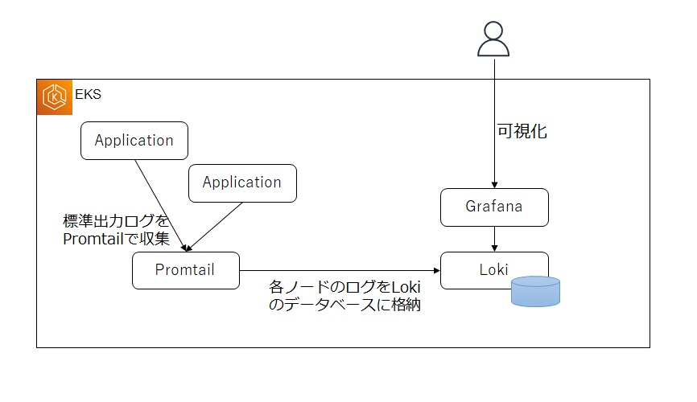

# ログ概要
各サーバやミドルウェア、アプリケーションなどにおいて、個別のイベント（何が発生しているのかの情報）を表す、人間が読める詳細な構造化情報 \
マイクロサービスのような分散アーキテクチャを採用した場合、1つのアプリケーションは複数のサービスで構成されることになります。
このため、管理対象ログファイルの数は以前と比較すると飛躍的に多くなり、ファイルレベルでなく、全体のログを一元管理するためのバックエンドサービスは不可欠と言えます。
# Kubernetesのログモニタリング
Kubernetesを含めて、コンテナアプリケーションではアプリケーションログの書き込み先をログファイルではなく、標準出力や標準エラー出力にするのがベストプラクティスです。Kubernetesでは、各コンテナの標準出力から出力されたログをAPIから閲覧できるようになっています。

# ログ集約
Kubernetes(具体的にはkubelet)では、コンテナの標準出力/標準エラー出力はコンテナログファイルとして各ノードで保管されます。
したがって、これらのログファイルを継続的に収集することで、ログを一元管理するバックエンドサービスに送信することが可能となります。

## ログ収集、集約分析ツール
- ログ収集、転送ツール \
  Fluentd/FluentBit、promtail、logstash
- ログ管理、分析ツール \
  Amazon CloudWatch、ElasticSearch/OpenSearch、Loki、S3等のオブジェクトストレージ

## Fluent Bit / Amazon CloudWatch
AWSモニタリングのフルマネージドサービスである`Amazon CloudWatch`をログ分析のバックエンドサービスとして利用

### インストール前の準備
- IAM Policy(Fluent BitからCloudWatchへアクセスする用)
- IAM Role(EKSのOIDCプロバイダ経由でk8sのServiceAccountが引受可能な)
- k8s上にServiceAccountを作成して上記IAM Roleと紐付け

### Fluent Bitのインストール
- Helm Chartベースで設定情報を宣言的に管理、インストールする。\
  AWSではFluentdは非推奨となるため、Fluent Bitを利用する。
https://artifacthub.io/packages/helm/aws/aws-for-fluent-bit

### ログ収集結果の確認
`Amazon CloudWatch`上のロググループ、ログインサイトから確認する。\
ログインサイトでは任意のクエリでログを検索できる。 \
https://developer.mamezou-tech.com/containers/k8s/tutorial/ops/cloudwatch/#%E3%83%AD%E3%82%B0%E5%8F%8E%E9%9B%86%E7%B5%90%E6%9E%9C%E3%81%AE%E7%A2%BA%E8%AA%8D

## Promtail / Grafana Loki
PromtailはDaemonSetで各ノードに配置され、各コンテナが標準出力したログを自動で収集してくれるようになっています。ちなみに、各コンテナのログはノードの/var/log/pods/以下に書き込まれています。
GrafanaのデータソースにLokiを設定すると、アプリケーションのログが表示できるようになっています
アプリケーションによっては、コンテナの標準出力ではなくファイルにログを書き込むものがあります。その場合は、同一Podのサイドカーコンテナとしてpromtailを動かしてLokiにログを転送するようにPodを構成しましょう。

### アーキテクチャ
各ノードにDaemonsetとしてデプロイしたPromtailが標準出力ログを収集し、GrafanaLokiでログを永続化します。Grafanaでは永続化したログを可視化します。

### loki-stackのインストール
https://artifacthub.io/packages/helm/grafana/loki-stack
promtail,loki,etcが含まれるパッケージ

#### Lokiのデータ格納先をS3にする
https://www.ogis-ri.co.jp/otc/hiroba/technical/kubernetes_use/part5.html

### サンプルアプリケーションによるログ出力
https://www.ogis-ri.co.jp/otc/hiroba/technical/kubernetes_use/part5.html

# おすすめ構成例
https://atmarkit.itmedia.co.jp/ait/articles/2202/25/news014.html#041

