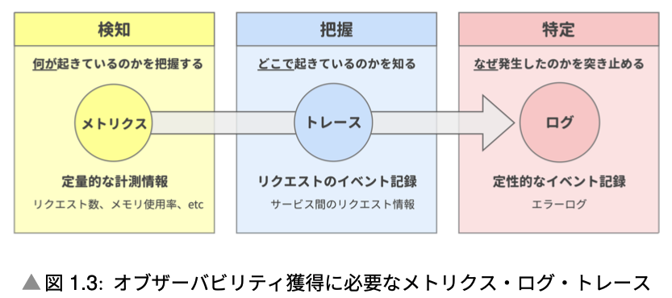
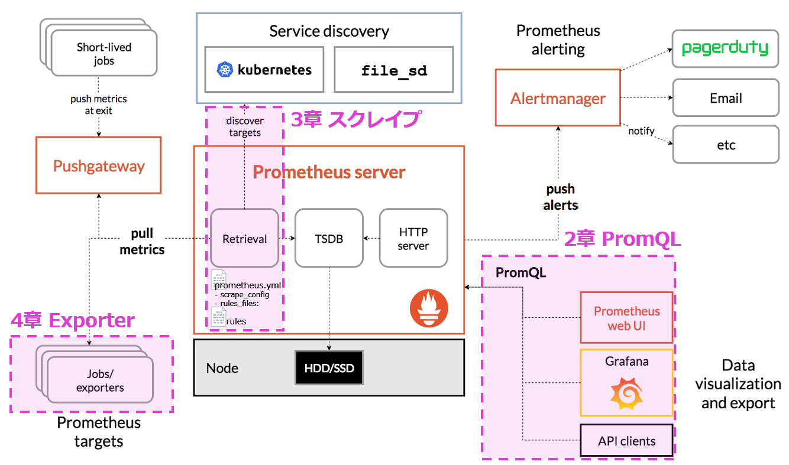
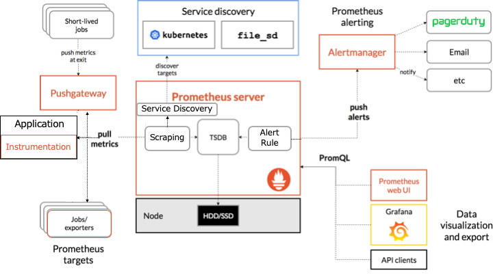
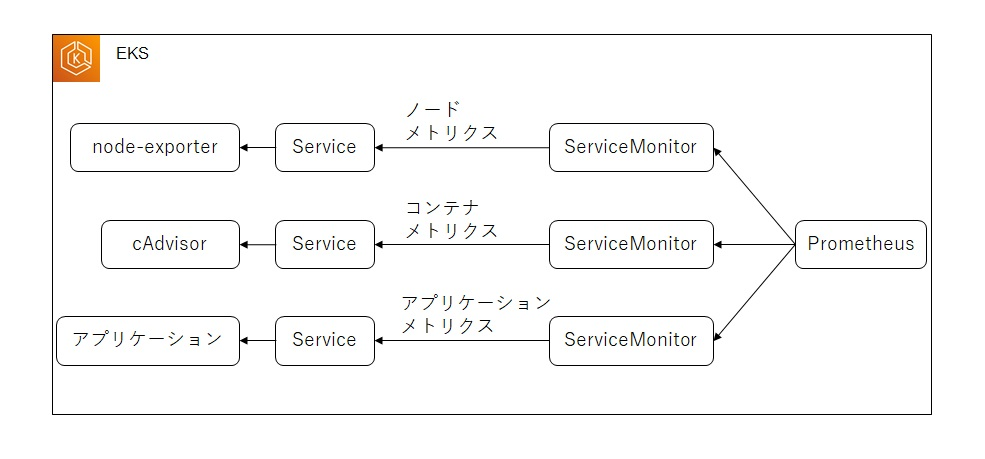
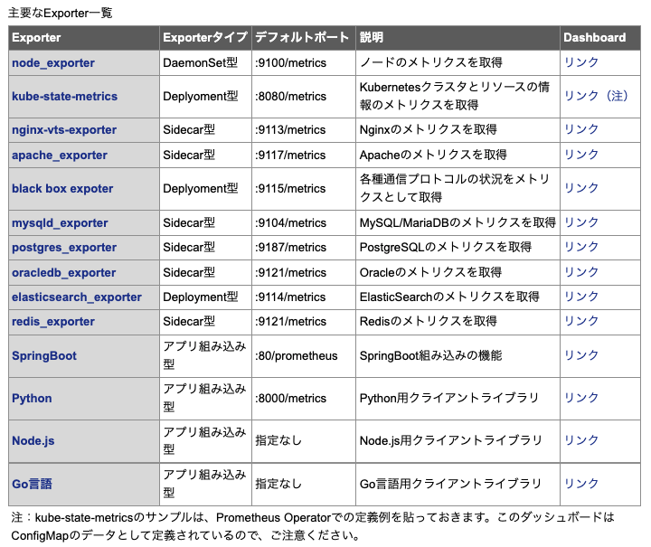
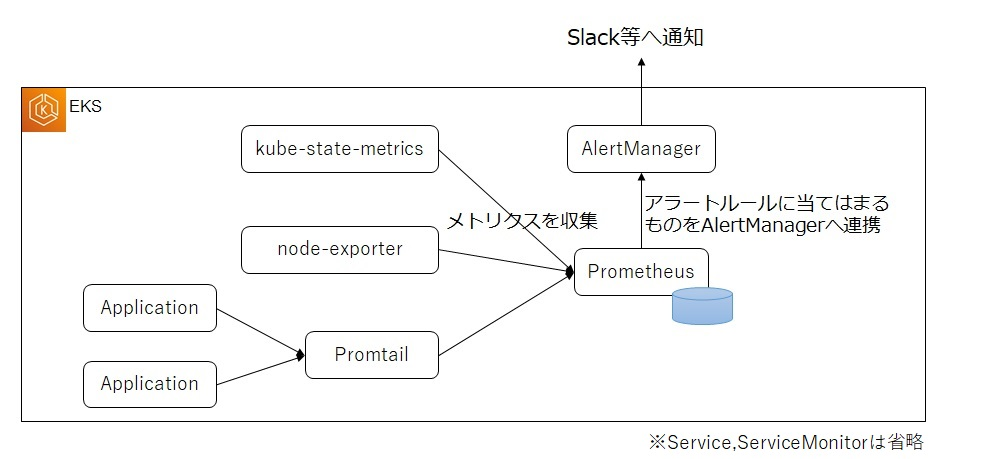
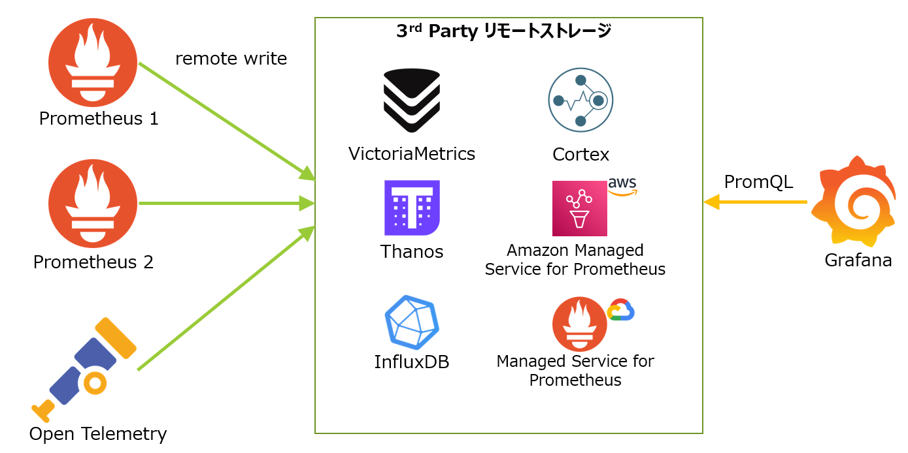
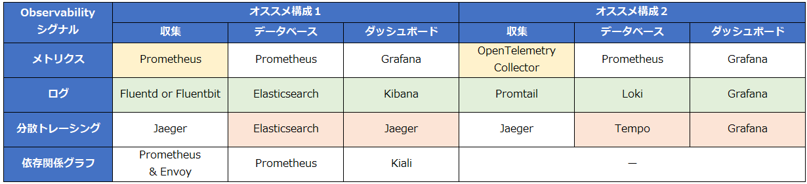

# Observability(観測可能性)
いつ、何が、どこで起こっているのかを観測可能に保つ
Observabilityを備えることで、複雑かつ動的にスケールするサービスでも、ワークロードの状態を正しく理解できるので、問題の検出やその根本原因の特定を行えます。クラウドネイティブなシステムにおける監視の課題は、Kubernetesを例に取ると下記のようなシステムの複雑さによる課題があり、これらの課題をはらんだシステムを安定的に運用するには適切な技術を用いて「いつ、何が、どこで起こっているのかを観測可能に保つ」必要があるからです。
### Observability(観測可能性)の構成要素
- メトリクス
- トレース
- ログ


# メトリクスとは
メトリクスは、サーバのリソース状況（CPU使用率など）やサービス状況（レイテンシ、トランザクション量、エラーレートなど）といった、指標となる数値データ
　通常「リアルタイム監視とアラート」「傾向分析、将来予測」の2つの方法で利用
#### メトリクスの要素
取得できる項目は以下に大きく二分できます。
- サービスの稼働状況の監視
- サーバやコンテナのリソース状況の監視

サービスの稼働状況について重要な指標となる次の3要素を監視するのが、REDメソッドです。\
そのサービスが、エンドユーザーから見てどのようなサービスレベルか（どれくらいアクセスが来ていて、どれくらい高速かつ正常にレスポンスを返しているのか）を監視。アラートや障害対応時の優先度もこのメトリクスに基づいて実施するのが基本的には望ましい。
- Rate：毎秒リクエスト数（req/sec）
- Error Rate：エラー率
- Duration：レイテンシ、レスポンスタイム

サーバのリソース状況について重要な指標となる次の3要素を監視するのが、USEメソッドです。\
サービス監視メトリクスと併せて確認することで、遅延時のボトルネック箇所など根本原因の特定に利用
- Utilization：使用率（CPU使用率など）
- Saturation：飽和度、どれくらいキューに詰まっているか（ロードアベレージなど）
- Errors：エラーイベントの数（Pod再起動など）

# Metrics API
KubernetesにはPod、Nodeのメトリクスを取得するための標準の方法としてMetrics APIが定められています。
```
▶ k top node
error: Metrics API not available
```
Metrics APIを利用するための最もメジャーな方法は`Metrics Server`をクラスタにインストールすることです。
`Metrics Server`はkubeletを通してcontainerdなどのコンテナランタイムからメトリクスを取得し、kube-apiserverを通して取得できるようにします。
Metrics APIはKubernetesのオートスケールの仕組みであるHorizontal Pod AutoscalerやVertical Pod Autoscalerでも利用されます。
Metrics Serverを導入することで、CPU利用率とメモリ使用量の2つのメトリクスを利用してPodをオートスケールできます。

kubernetes-dashboardなどのダッシュボードツールを利用すると、Metrics APIから取得したデータをWebUI上で可視化できます。

# Prometheus概要
## Prometheusアーキテクチャ
https://atmarkit.itmedia.co.jp/ait/articles/2205/31/news011.html

PrometheusはPULL型のメトリクス収集を採用していますので、Prometheus側から定期的にメトリクスを取りに来ます。PUSH型の場合はアプリケーション側からメトリクスをモニタリングツールに送ります。
TODO:データが失われてしまうので実際に運用する場合はpersistentVolumeを用意しておきましょう。

---


https://www.ogis-ri.co.jp/otc/hiroba/technical/kubernetes_use/part5.html

`ServiceMonitor`リソースでターゲットとなる`Service`を指定し、Prometheusは`ServiceMonitor`で定義されているサービスからメトリクスを収集します。（`Service`を定義していないPod用に`PodMonitor`もあります） \
ノードに関するメトリクスはnode-exporterから、コンテナに関するメトリクスはcAdvisorから収集します。prometheus-operatorを導入するとこれらのメトリクスを収集するためのServiceMonitorが標準で導入されます。アプリケーションが出力するメトリクスの監視は個別にServiceMonitorを導入して監視します。

### インストルメンテーション (Instrumentation) とは
インストルメンテーション (Instrumentation) とは、アプリケーションにメトリクスを生成するソースコードを追加するコンポーネントです。\
https://hogetech.info/oss/docker/prometheus
# Kubernetesリソースのメトリクス収集・可視化
Metrics APIを利用したモニタリングはKubernetes固有の仕組みで**Prometheusに直接対応するものではない**ため、PrometheusでPod、Nodeのメトリクスを収集するにはmetrics-serverではなく、別途exporterをインストールする必要があります。Nodeについては`node-exporter`、Podや他Kubernetesリソースについては`kube-state-metrics`が最も広く利用されています。HelmでKubernetesクラスタにPrometheusをインストールした場合には、これらのexporterも同時にインストールされています。
`kube-prometheus-stack`では、デフォルトでデータソース(=Prometheus)の設定に加えて、Kubernetesのコンテナ関連のメトリクス収集やGrafanaのダッシュボードがセットアップされています。
したがって、インストールした時点で既に各種メトリクス収集が始まり、Grafanaダッシュボードをメトリクスを確認できます。

# アプリケーション固有のメトリクス収集・可視化

### Golang
#### アプリケーションコード内の実装
```Golang
import (
  ...
  "github.com/prometheus/client_golang/prometheus"
  "github.com/prometheus/client_golang/prometheus/promhttp"
)

var (
  httpReqs = prometheus.NewCounterVec(
    prometheus.CounterOpts{
      Name: "http_request_total",
      Help: "Number of HTTP Request.",
    },
    []string{"path"},
  )
)

func init() {
  prometheus.MustRegister(httpReqs)
}

func metrics(w http.ResponseWriter, r *http.Request) {
  promhttp.Handler().ServeHTTP(w, r)
}

func handler(w http.ResponseWriter, r *http.Request) {
  m := httpReqs.WithLabelValues("/")
  m.Inc()
  fmt.Fprint(w, string("hello world"))
}

func main() {
  http.HandleFunc("/metrics", metrics)
  http.HandleFunc("/", handler)
  http.ListenAndServe(":18080", nil)
}
```
#### Prometheus側でのメトリクス収集定義
アプリケーションのServiceをターゲットとするServiceMonitorリソースを作成します。この例では、defaultネームスペースにある「app: demo-service」ラベルを持つサービスをターゲットに「spec.ports.name: http」のポートからメトリクスを収集するServiceMonitorが作成されます。
```yaml
apiVersion: monitoring.coreos.com/v1
kind: ServiceMonitor
metadata:
  name: servicemonitor-demo-service
  namespace: monitoring
  labels:
    serviceapp: demo-service
    release: prometheus-operator
spec:
  selector:
    matchLabels:
      app: demo-service
  endpoints:
  - port: http
    interval: 30s
  namespaceSelector:
    matchNames:
    - default
```

### Node.js
#### アプリケーションコード内の実装
自動でNode.jsのメトリクスを生成し、エンドポイントを公開するprometheus-api-metricsを使用します。
後は、エントリーポイントのindex.tsでセットアップ用のコードを追加するだけです。
```Node.js
import apiMetrics from 'prometheus-api-metrics';

const app = express();
app.use(express.json());
// Express appに登録
app.use(apiMetrics())
```
これだけで、Prometheus向けのメトリクス収集エンドポイントが/metricsで公開されます[5]。

#### Prometheus側でのメトリクス収集定義
Prometheusがこのメトリクスを収集するためには、Prometheus Operatorのカスタムリソース`ServiceMonitor`を作成する必要があります。
```
apiVersion: monitoring.coreos.com/v1
kind: ServiceMonitor
metadata:
  name: task-service-monitor
  namespace: prod
  labels:
    release: kube-prometheus-stack
spec:
  endpoints:
    - path: /metrics
      targetPort: http
      interval: 30s
  selector:
    matchLabels:
      app: task-service
```
注意点としては`labels`です。デフォルトではPrometheus Operatorはこのラベルがつけられたものをメトリクス収集対象として認識しますので、これがないとメトリクスは収集されません。
それ以外は`endpoints`でアプリケーション側のメトリクス収集のエンドポイントを指定し、`selector`で収集対象のServiceオブジェクトのラベルを指定しています。
これでPrometheusはService経由で`/metrics`のエンドポイントから、30秒間隔でメトリクスを収集するようになります。
アプリケーションのロジックに手を入れることなく、アプリケーションメトリクスを収集、可視化ができる

### Java Spring & Nuxt.js
#### アプリケーションコード内の実装
Spring FrameworkとNuxt.jsのPrometheus Exporter Moduleを導入してイメージをビルドします。変更内容の詳細を見てみたいという方は、[GitLab.com](https://gitlab.com/creationline/thinkit-kubernetes-sample1/-/commit/27509131575f55a50b36b129099ebdf09d8e677b)のコミットログを参照してください。

#### Prometheus側でのメトリクス収集定義
exporterが用意ができたら、Prometheus側でこれらのExporterからメトリクスを収集する設定が必要となります。PrometheusにはKubernetesクラスタのための[kubernetes_sd_config](https://prometheus.io/docs/prometheus/latest/configuration/configuration/#kubernetes_sd_config)という設定値があるので、多くの場合ではこちらを利用すると便利です。この設定により、PodやServiceのAnnotationに特定の値を記述することで、Prometheusが自動的に値を収集してくれます。
```
# base/deployment-accesscount.yaml
apiVersion: apps/v1
kind: Deployment
metadata:
  labels:
    app: accesscount
  name: accesscount
spec:
  template:
    metadata:
      annotations:
        prometheus.io/scrape: 'true'
        prometheus.io/path: '/actuator/prometheus'
        prometheus.io/port: '8080'
...
# base/deployment-website.yaml
apiVersion: apps/v1
kind: Deployment
spec:
metadata:
  labels:
    app: website
  name: website  template:
    metadata:
      annotations:
        prometheus.io/scrape: 'true'
        prometheus.io/path: '/'
        prometheus.io/port: '9091'
...
```

## アプリケーション特性に沿ったカスタムメトリクス収集
これには、アプリケーション内でカスタムメトリクスをPrometheusに公開し、Grafanaで可視化する必要があります。
アプリケーション側では、Prometheusのクライアントライブラリのprom-client[6]がありますので、これを利用してメトリクスの生成をします。これでメトリクスエンドポイントにカスタムメトリクスが追加で公開されます。

後は、Grafanaの方で、Prometheusクエリ言語のPromQLを使ってメトリクスを取得すれば、Grafanaの豊富な可視化機能を利用できます。

## Exporter
各言語で利用できるライブラリ、さまざまなミドルウェアやソフトウェアで利用できるメトリクスを収集、公開するエージェント
さまざまなミドルウェアやソフトウェアからメトリクスを収集、Prometheusからスクレイプできるようにエンドポイントを公開するのがExporterです
メトリクスを収集する方法としてPrometheusのクライアントライブラリを利用してプログラミング言語側で自前で実装することも可能ですが、よく使われるミドルウェアなどではExporterを利用するのが便利です。
- 公開Exporter
  - https://github.com/prometheus
  - https://prometheus.io/docs/instrumenting/exporters/

#### Exporterのデプロイ方式
- DaemonSet型 \
  KubernetesのDaemonSetとして各NodeにExporterのPodを1つ配置する方法。 各Nodeで公開しているモニタリングターゲットからメトリクスを収集する必要がある際にこの方式を採る
- Deployment型 \
  クラスタ内に1つエクスポーターを配置する方法。Kubernetes APIサーバや外部のDBなどに対してメトリクスを取得する際などにこの方式を採る
- Sidecar型 \
  プロセスとして起動し、他のミドルウェアやアプリケーションを監視する方式。厳密には、Podとしてデプロイして利用することもできるが、監視対象とExporterは同じPod内にあった方がネットワーク負荷の点から、こっちの方がよい。監視対象とExporterは1対1の方が管理しやすいというメリットがある（Exporter1に対して監視対象が複数あると、監視対象をExporterで管理する必要があるので）。このような場合は、Sidecarとして、Exporterをデプロイした方が管理しやすくなる。本記事では、Sidecarでの管理をお勧めするので、ExporterをSidecar型と定義する
- アプリ埋め込み型 \
  アプリケーション、ミドルウェアにコードを埋め込んでアプリケーション、ミドルウェア自身でメトリクスを公開する。メトリクス公開の方法としてはPrometheusや「Open Telemetry」のSDKを利用する方法がある

#### 主なExporter一覧



# アラート
## AlertManagerアーキテクチャ

Prometheusで収集したメトリクスをアラートルールに基づいてAlertManagerへ連携します。AlertManagerから各ツール（Slack、メール等）に連携する仕組みになります。AlertManagerはアラートの一覧確認や一時的な抑制などを行うためのツールになります。

### アラートルールとは
Prometheus サーバーのアラートが発火するルールです。\
例えば、「CPU > 90% でアラートを発火」などのルールを定義できます。\
アラートルールはアラートを発火するだけで、何もしません。

#### アラート設定内容
https://knowledge.sakura.ad.jp/11635/
### アラート対象のモニタリング
メトリクス結果をアラートとして認識するようにアラートルールを設定します。この例では1分間にエラーが1つ以上出力されたら「severity: critical」ラベルを付与したアラートを作成します。
```yaml
apiVersion: monitoring.coreos.com/v1
kind: PrometheusRule
metadata:
  name: demo-alert-rules
  namespace: monitoring
  labels:
    app: kube-prometheus-stack
    release: prometheus-operator
spec:
  groups:
# 1分間にエラーが1つ以上出力されたら「severity: critical」ラベルを付与したアラートを作成
- name: rules-demo-alert
    rules:
    - alert: ApplicationError
      expr: >-
          count (promtail_custom_log_error_total) > 0
      for: 1m
      labels:
        severity: critical
      annotations:
        message: >-
          {{ $labels.job }}/{{ $labels.service }} targets in {{ $labels.namespace }} namespace are application error.
```
### Alertingmanager とは
Alertmanager は、Prometheus サーバーから受信したアラートをメールやチャットなどに送信します。

### AlertManager設定
AlertMangerでは主にreceivers句とroute句を設定します。receivers句ではアラートの送信先に関する設定を定義し、route句ではどの条件の場合にどのレシーバに流すかを定義します。
```yaml
apiVersion: v1
kind: Secret
metadata:
  labels:
    alertmanager: main
    app.kubernetes.io/component: alert-router
    app.kubernetes.io/name: alertmanager
    app.kubernetes.io/part-of: kube-prometheus
    app.kubernetes.io/version: 0.22.2
  name: alertmanager-main
  namespace: monitoring
stringData:
  alertmanager.yaml: |-
    "global":
      "resolve_timeout": "5m"
      "slack_api_url": "<slack_webhook_url>"
    "receivers":
    - "name": "Default"
    - "name": "slack_notifications"
      "slack_configs":
      - "channel": "#<チャンネル名>"
        "send_resolved": true
    "route":
      "group_by":
      - "namespace"
      "group_interval": "5m"
      "group_wait": "30s"
      "receiver": "Default"
      "repeat_interval": "12h"
      "routes":
      # 「severity: critical」ラベルのついたアラートはSlackへ通知
      - "match":
          "severity": "critical"
        "receiver": "slack_notifications"
type: Opaque
```

### Grafana UIからのアラート設定
https://recruit.gmo.jp/engineer/jisedai/blog/kubernetes-metrics-and-alert-notification/　\
以下の設定をGrafana上から行える。**ただし、上述のPrometheus/Alertmanagerと異なる定義、管理方式となる**
- アラート通知先(Contact Point)
- 通知ポリシー(Notification Policy)
- アラートルール(Rules)
# Prometheus運用ポイント
### PrometheusOperator
Prometheus OperatorはKubernetesオペレーターの一つで、Prometheusと関連コンポーネント管理するものです。Prometheusをリソース定義として扱えたり、ラベルをしていることでスクレイプ設定を自動的に生成できる「PodMonitor」「ServiceMonitor」を利用できたりします。Prometheusリソースでは、Prometheusのバージョンやデータ永続化、レプリカ数の定義などができます。
- kube-prometheus
- kube-prometheus-stack

### TODO:サードパーティーのリモートストレージ
リモートストレージに対してPrometheusのRemote Write機能でデータを書き出し、メトリクスの分析、可視化はストレージに対して、GrafanaからPromQLを発行するようなイメージです。


### TODO:Grafanaのダッシュボードのコード管理
Prometheus Operatorを利用したGrafanaを利用した場合、ダッシュボードは、ConfigMapで管理されているので、作成したダッシュボードのファイルからConfigMapを作成し、「Git」で管理してKubernetesにデプロイするようにすると便利です。


# おすすめ構成例
https://atmarkit.itmedia.co.jp/ait/articles/2202/25/news014.html#041

