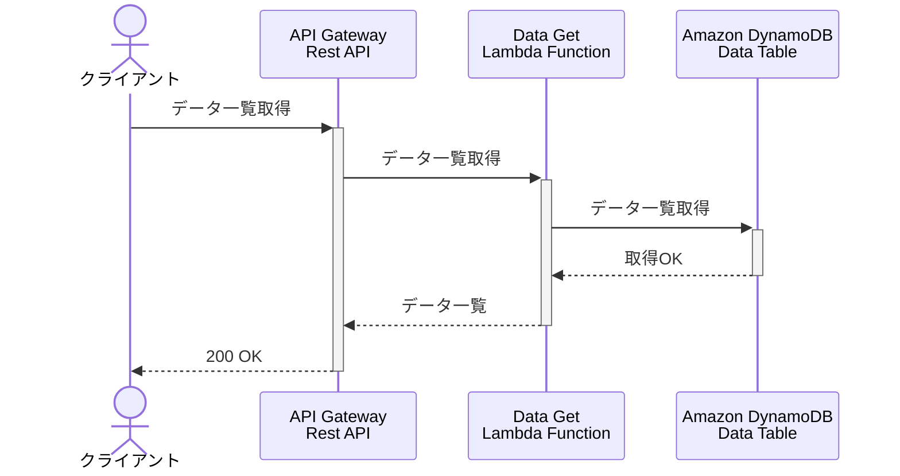
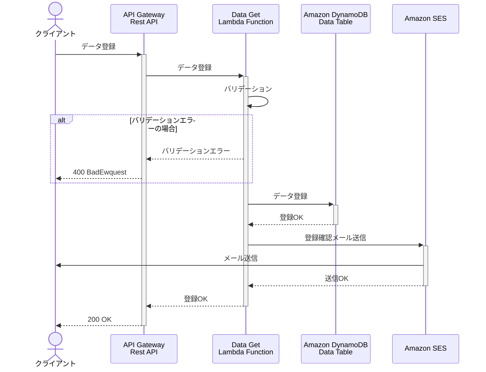

# references
色々便利なやつをまとめた

## シーケンス図 by Mermaid
https://dev.classmethod.jp/articles/drawing-a-sequence-diagram-of-a-common-aws-serverless-configuration-with-mermaid/
https://marketplace.visualstudio.com/items?itemName=bierner.markdown-mermaid

### データ一覧取得

### データ登録

