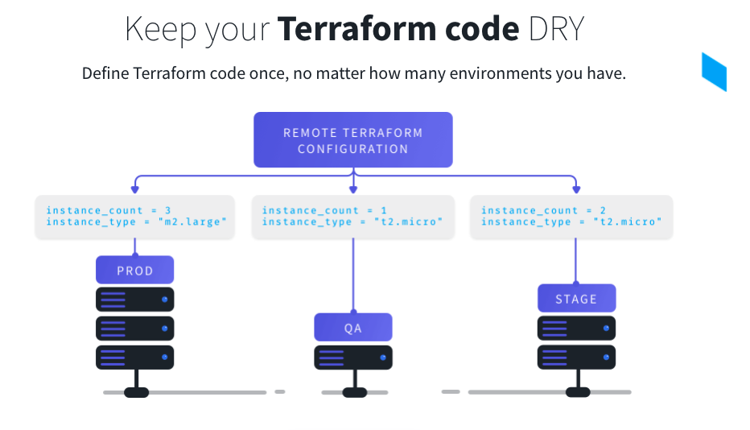

# IaCのメリット
- 手順書の維持管理が不要になる
- オペレーションミスのリスクを大幅に減らせる
- 属人性を減らせる
- GitHub上で複数人で変更をレビューできる
- インフラのセキュリティリスクをコードの段階で検証できるようになる
- 同様な構成環境を複数構築することが容易になる


# Current state と Desired state
- 望むべきインフラの状態を定義：`main.tf`
- 現在のインフラの状態を管理：`terraform.tfstate`
- 現在の実体： 存在するAWSオブジェクト、リソース

# Remote Backend
- 複数人による処理バッティングを防ぐ排他制御、バージョン管理、暗号化対応 \
https://blog-benri-life.com/terraform-state-aws-s3-dynamodb-backend/

### リモートステートバケットの作成と設定
```
# ステートバケットの作成
aws s3api create-bucket --bucket mailpaas-dev-remote-tfstate --create-bucket-configuration LocationConstraint=ap-northeast-1

# バージョニング設定
aws s3api put-bucket-versioning --bucket mailpaas-dev-remote-tfstate --versioning-configuration Status=Enabled

# 暗号化設定
aws s3api put-bucket-encryption --bucket mailpaas-dev-remote-tfstate \
--server-side-encryption-configuration '{
  "Rules":[
            {
              "ApplyServerSideEncryptionByDefault":{
              "SSEAlgorithm":"AES256"
              }
            }
          ]
      }'

# ブロックパブリックアクセス設定
aws s3api put-public-access-block --bucket mailpaas-dev-remote-tfstate \
--public-access-block-configuration '{
  "BlockPublicAcls":true,
  "IgnorePublicAcls":true,
  "BlockPublicPolicy":true,
  "RestrictPublicBuckets":true
}'

# ライフサイクルルール設定
aws s3api put-bucket-lifecycle-configuration --bucket nextgen-master-management-dev-remote-tfstate --lifecycle-configuration \
'{
    "Rules": [
        {
            "Expiration": {
                "Days": 180
            },
            "ID": "Bucket-Rules for deletion after 180 days",
            "Filter": {},
            "Status": "Enabled",
            "NoncurrentVersionExpiration": {
                "NoncurrentDays": 1
            },
            "AbortIncompleteMultipartUpload": {
                "DaysAfterInitiation": 7
            }
        }
    ]
}'
```

### 排他制御(ロック)テーブルの作成
```
aws dynamodb create-table \
        --table-name mailpaas-tes-backend-lock \
        --attribute-definitions AttributeName=LockID,AttributeType=S \
        --key-schema AttributeName=LockID,KeyType=HASH \
        --provisioned-throughput ReadCapacityUnits=1,WriteCapacityUnits=1
```
output:
```
{
    "TableDescription": {
        "AttributeDefinitions": [
            {
                "AttributeName": "LockID",
                "AttributeType": "S"
            }
        ],
        "TableName": "mailpaas-dev-backend-lock",
        "KeySchema": [
            {
                "AttributeName": "LockID",
                "KeyType": "HASH"
            }
        ],
        "TableStatus": "CREATING",
        "CreationDateTime": "2022-08-05T17:06:10.125000+09:00",
        "ProvisionedThroughput": {
            "NumberOfDecreasesToday": 0,
            "ReadCapacityUnits": 1,
            "WriteCapacityUnits": 1
        },
        "TableSizeBytes": 0,
        "ItemCount": 0,
        "TableArn": "arn:aws:dynamodb:ap-northeast-1:949993607219:table/mailpaas-dev-backend-lock",
        "TableId": "340514fc-1a2d-4d27-9ad5-991b0ef649ac"
    }
}
```

## terraform backend設定
```
terraform {
  required_version = "~> 1.2.0"
  # remote state settings
  backend "s3" {
    bucket = "mailpaas-dev-tfstate"
    key    = "default/terraform.tfstate"
    region = "ap-northeast-1"

    dynamodb_table = "mailpaas-dev-backend-lock"
    encrypt        = true
  }

```

# 変数定義とその扱い
- コマンド引数 (-var = <VALUE>)
- 環境変数 ( TF_VAR_<NAME> )
- 変数ファイル( example.tfvars)

## 管理方法
tfstateの分割指針としては、普段から変化のないもの(network系)と変化のあるものと分けるのが通例と考える。
Workspaceは便利のようで使い方を誤ると危ないため、運用ではそこまで使われるケースは少ないらしい。
- Network,RDSなどは別Stateで管理.
- Workspaceは使用しない
- 環境毎の情報はtfvarsファイルで環境毎に用意する

## Module関連
公開されているModuleは取説を最後まで読むこと。オプションで色々機能が有る
チームで管理する場合は、公式モジュールの利用優先度を決める方が良い
Moduleを作成する際には[Standard Module Structure](https://www.terraform.io/registry/modules/publish)をまず見る。
output/inputの内容を理解すること

- 生産性と統一性を優先に公式のModuleを率先して使用する
- 使用前に要件があっているか実際って確認する
- モジュールを作る場合、粒度を考える。(app_serverみたいな)特化型のモジュールも有り?

# コードをフォーマットし、見栄えを揃える
`terraform fmt -recursive` \
`terraform fmt -recursive -check`

# 構文エラーを確認
`terraform validate`

# 初期化処理
```
▶ terraform init
Initializing modules...

Initializing the backend...

Initializing provider plugins...
- Reusing previous version of hashicorp/kubernetes from the dependency lock file
- Reusing previous version of hashicorp/cloudinit from the dependency lock file
- Reusing previous version of terraform-aws-modules/http from the dependency lock file
- Reusing previous version of hashicorp/local from the dependency lock file
- Reusing previous version of hashicorp/aws from the dependency lock file
- Reusing previous version of hashicorp/http from the dependency lock file
- Installing hashicorp/kubernetes v2.9.0...
- Installed hashicorp/kubernetes v2.9.0 (signed by HashiCorp)
- Installing hashicorp/cloudinit v2.2.0...
- Installed hashicorp/cloudinit v2.2.0 (signed by HashiCorp)
- Installing terraform-aws-modules/http v2.4.1...
- Installed terraform-aws-modules/http v2.4.1 (self-signed, key ID B2C1C0641B6B0EB7)
- Installing hashicorp/local v2.2.2...
- Installed hashicorp/local v2.2.2 (signed by HashiCorp)
- Installing hashicorp/aws v4.4.0...
- Installed hashicorp/aws v4.4.0 (signed by HashiCorp)
- Installing hashicorp/http v2.1.0...
- Installed hashicorp/http v2.1.0 (signed by HashiCorp)

Partner and community providers are signed by their developers.
If you'd like to know more about provider signing, you can read about it here:
https://www.terraform.io/docs/cli/plugins/signing.html

Terraform has made some changes to the provider dependency selections recorded
in the .terraform.lock.hcl file. Review those changes and commit them to your
version control system if they represent changes you intended to make.

Terraform has been successfully initialized!

You may now begin working with Terraform. Try running "terraform plan" to see
any changes that are required for your infrastructure. All Terraform commands
should now work.

If you ever set or change modules or backend configuration for Terraform,
rerun this command to reinitialize your working directory. If you forget, other
commands will detect it and remind you to do so if necessary.
```

# plan結果をファイル出力
tfコードとtfstateが比較される
`terraform plan -no-color > tfplan.txt`

### plan結果を見やすく出力
`terraform plan -no-color | grep --line-buffered -E '^\S+|^\s{,2}(\+|-|~|-/\+) |^\s<=|^Plan'\n`
# プロビジョニング
tfstateが更新される
```
terraform apply

module.eks.aws_eks_cluster.this[0]: Still creating... [8m31s elapsed]
module.eks.aws_eks_cluster.this[0]: Still creating... [8m41s elapsed]
〜
module.eks.module.node_groups.aws_eks_node_group.workers["provisioning"]: Still creating... [10s elapsed]
[id=system-dev-test-1shikawa:system-dev-test-1shikawa-provisioning2022032809272418990000000e]

Apply complete! Resources: 42 added, 0 changed, 0 destroyed.
```

# 特定リソースのみ適用
```
terraform apply -target aws_s3_bucket.local_staging_bucket
```
## tftarget
複数のメンバーが開発を行う際、各メンバーが定義したリソースを破壊することなく、安全に運用できるようになります。
[tftarget:Terraformターゲットを選択的に実行するためのGo製CLIツール](https://future-architect.github.io/articles/20230329a/)


# コーディング規約
## 値のハードコードをためらわない
値をハードコードするのは悪だと、プログラマーは教わってきたと思います。私もそうですし、普通のコードを書くときはハードコードを避けています。
しかし今回のTerraformでは、状況によってはハードコードするようにしました。
具体的には、以下の条件をすべて満たす場合です。

- 環境ごとで値が変わらない
- 普段の運用で変更する可能性が（ほぼ）ない
- 他のプロダクトで使うときでも変更しない可能性が高い

## ECSのタスク定義の扱い
ECSのタスク定義をTerrafromとアプリケーションのどちらで管理するか、という部分はいまだに悩んでいます。コンテナインスタンスの管理という点では、Terraformで扱うのが普通のような気がします。しかしアプリケーションの動作を変えるため、よく変更するものでもあるので、そのたびにapplyするのは、あまり合理的ではないようにも感じます。

今はすべてTerraformで管理するようにしていますが、頻繁に変更する部分だけはアプリケーションで管理し、全体のベースとなるものはTerraformで管理する、というのを試してみようと思っています。ただ、それがベストかどうかは自信が持てないので、この先も試行錯誤が続くでしょう。

# ドキュメント生成
モジュールの入力変数、出力変数定義をまとめたドキュメントを自動生成する。
```
terraform-docs markdown table --output-file README.md --output-mode inject ./path/to/module
```
# Terraformer
リソースからTerraformのコード+tfstateを自動で生成するツール。

Terraformerを使わなくてもterraform importコマンドを使うことでリソースを取り込むことはできるが、\
Terraformerを使うことのメリットは次の通り。
- tfstateとコードを両方生成してくれる。対してterraform importはtfstateのみ生成。
- 複数のリソースを一括で取り込める。対してterraform importは1リソースだけ。

リソースをTerraformで作成するときと同様、取り込みたいリソースのprovider pluginが必要となる。

### Terraformerの罠
- デフォルトのポリシーなども読み込んでしまう
  - タグ付けやIDでフィルタリングできるのでこれらのオプションを駆使して工夫して実際にコード化したいリソースをインポートする必要がある。
- 使えるTerraformのバージョンが古い
- 依存関係は解決してくれない
  - 生成されるソースはsubnet_idやvpc_id、IAMのロール名やARNなどがハードコーディングされた状態で自動生成されてしまいます。これではTerraform側でリソース同士の依存解決がされない
- 自動生成されたコードはそのまま使えない
  - `terraform import`してtfstate見ながらTerraform書いた方が結果はやくて正確な作業ができる

# Terragrunt



### terragrunt.hcl
Terragrunt でリソース管理を行うには、バックエンド設定などを記述する`terragrunt.hcl`というファイルが必要になります。 \
`terragrunt.hcl` には 1 つの親ファイルと複数の子ファイルがあり、共通的な設定（バックエンド情報など）を親ファイルに記述します。\
これを複数の子ファイルから参照することで DRY な記述を実現しています。 \
https://zenn.dev/simpleform/articles/20221111-01-terraform-with-terragrunt
