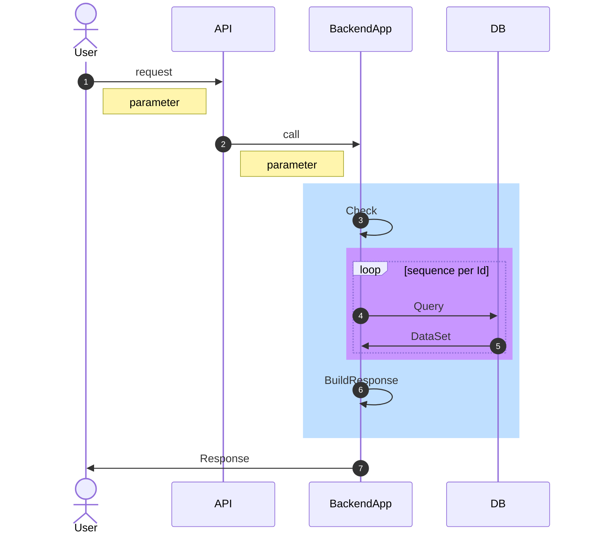

# [Mermaid記法に入門しよう](https://qiita.com/moikei/items/24e9e5bd8319a10f0115)

```mermaid
sequenceDiagram
    autonumber
    actor U AS User
    participant A AS API
    participant L AS BackendApp
    participant DP AS DB
    U->>A: request
    Note right of U: parameter
    A->>L: call
    Note right of A: parameter
    rect rgb(191, 223, 255)
    L->>L: Check
    rect rgb(200, 150, 255)
    loop sequence per Id
        L->>DP: Query
        DP->>L: DataSet
    end
    end
    L->>L: BuildResponse
    end
    L->>U: Response
```
