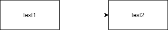

# GitHub+VSCodeでのMarkdownドキュメンテーションのプロジェクトルールを考える

https://zenn.dev/ttani/articles/github-vscode-documentation-rule


## ドキュメンテーション方針

Windows 環境、Mac 環境、Linux 環境のいずれであっても、閲覧・更新ができ、また、生産性の高いドキュメント作成及び、ドキュメントの履歴管理・レビュー運用を柔軟かつ迅速に実現するため、原則`Markdown`形式で作成し、`Pull Request` でのレビュー運用を行うものとします。

## Markdown 基本ルール

GitHub でのドキュメント閲覧を前提として、GitHub 仕様に準拠した`Markdown`を作成するものとします。

## Markdown エディタ

Markdown エディタは Formatter の制御を統一するために、`Visual Studio Code`及びプラグインを用いて行います。

| プラグイン                      | 必須 | 説明                                                                                                                                                                                                                 |
| ------------------------------- | :--: | -------------------------------------------------------------------------------------------------------------------------------------------------------------------------------------------------------------------- |
| Markdown All in One             |  〇  | Markdown に必要なプラグインの多くが入っています。                                                                                                                                                                    |
| Prettier                        |  〇  | Markdown のフォーマットを自動整形してくれます。<br>VSCode 設定`Setting`から、`Default Formatter`を`Prettier`に設定、`Format On Save`にチェックを入れてください。                                                     |
| Text Table                      |  〇  | Markdown 内でのテーブル作成が容易になります。`Ctrl`+`Shipt`+`P`で Command Pallet を起動して`create table`を選択して`n*n`指定でテーブルフォーマットが作れたり、`Ctrl+Q`２回押下で Table Mode になって編集ができます。 |
| Draw.io Integration             |      | 図などの作画が VSCode 内で簡単にできます。`Editable PNG`形式で作成することで、作成した図表ファイルをそのまま Markdown に埋め込めます。                                                                               |
| Paste Image                     |      | クリップボードに保存した画像を`Ctrl`+`Alt`+`V`でそのままファイル化及び画像埋め込みで Marddown 内に埋め込みができます。保存先パスの設定が必要なので、本ドキュメントの記載を参照してください。                         |
| Markdown Preview Github Styling |      | Markdown のプレビューが GitHub 表示に近くなります。<br>VSCode 設定`Setting`から、`Markdown-preview-github-styles: Color Theme`を`light`に設定すると、GitHub の表示により近くなります。                               |
| Git Graph                       |      | Git 関連の操作や確認が楽になります。                                                                                                                                                                                 |

## 基本ディレクトリ構成

```
.
┝ .vscode
│　└extensions.json : VSCodeで使用をリコメンドするプラグインを定義します。
┝ 01-xxx : 個別ドキュメントを格納します。フォルダ名は適宜定義します。
┝ 02-yyy : 個別ドキュメントを格納します。フォルダ名は適宜定義します。
└ assets : Markdownから参照する画像ファイルを格納するフォルダです。
 　┝ paste : クリップボードにコピーして貼り付けた画像を自動保存するフォルダです。
 　┝ 01-xxx : 入手・作成画像ファイルを手動で保存するフォルダです。フォルダ名は適宜定義します。
 　└ 02-yyy : 入手・作成画像ファイルを手動で保存するフォルダです。フォルダ名は適宜定義します。
```

## 見出しルール

ドキュメント内には`#`を用いて適切に見出しをつけることで、見出し一覧が自動で得作成されて、見出しへのジャンプが容易にできたり、アンカーリンク付きの URL が取得できます。

あとから情報を探しやすいように、適切な単位で見出しを区切ります。

```
# 見出し1
## 見出し2
### 見出し3
#### 見出し4
##### 見出し5
###### 見出し6
```

## テーブル作成ルール

テーブル作成は、GitHub の仕様に基づいて作成します。

https://docs.github.com/ja/get-started/writing-on-github/working-with-advanced-formatting/organizing-information-with-tables

`Text Tables`ブラグインを導入している場合、`Ctrl`+`Shipt`+`P`で Command Pallet を起動して`create table`を選択して`n*n`指定でテーブルを作成できます。

ファイルを作成したら、Markdown 内から作成した図をそのまま呼び出せます。
作成した表は、保存すると、Formatter により自動的に列横幅などが調整されます。

**Markdown の例**

```
| ヘッダ 1 | ヘッダ 2 |
| -------- | -------- |
| 内容セル | 内容セル |
| 内容セル | 内容セル |
```

**生成される表**
| ヘッダ 1 | ヘッダ 2 |
| ----- | ------ |
| 内容セル | 内容セル |
| 内容セル | 内容セル |

**補足：テーブル操作**

- 左右中央寄せの列を作る
  `-----`の行を`:---:`のように書くとその列は文字位置が中央寄せになります。

- Table Mode を切り替える
  `Ctrl`+`Q`を２回連続押下することで、Table Mode に切替らえます。Table Mode にすることで、テーブル操作が簡単に行えるようになります。

- (Table Mode)行を追加する
  テーブル末行内で`Enter`を押下すると、１行テーブルが増えます。

- 行を入れ替える
  VisualStudioCode 標準の動きですが、`Alt`+上下キーで行を入れ替えれられます。

- (Table Mode)列を入れ替える
  `Alt`+左右キーで列を入れ替えられます。

## ドキュメント内の画像参照

構成図などのイメージ及びイメージソースファイルに関しては、本リポジトリ内`assets`配下に格納して、ドキュメント内からはルート相対パスで参照するものとします。

例えば次のようなパスと参照方法になります。

**画像ファイルの格納パス**

```
assets/sample/sample.png
```

**Markdown での参照方法**

```


```

※注意：画像参照を貼り付けるときに直前の行にテキスト行などが存在すると、プレビューでは改行されて画像が表示されますが、GitHub 上では回り込んで表示されてしまいます。画像参照を設定するときは、上の行を空行を入れるように注意します。

**表示例**


## 作画ルール

Markdown 内で構成図などの図を参照する場合、`draw.io`(VSCode プラグインあり)を使用して、`Editable PNG`で記載します。
VSCode の`Draw.io Integration`プラグインを導入済みであれば、`*.drawio.png`の名前で新規ファイル作成するのみで、作画ツールを VSCode 内で起動できます。

**図表ファイル（`Editable PNG`）の格納パス**

```
assets/sample/test.drawio.png
```

**Markdown での参照方法**

```


```

**表示例**


## キャプチャ貼り付けルール

`Paste Image`プラグインを用いることで、クリップボードに保存した画像を VSCode 上で、`Ctrl`+`Alt`+`V`でそのまま Markdown 内にファイル化及び画像埋め込みできます。
範囲選択でキャプチャを取ってクリップボードに保管可能なツール(WinShot など)と組み合わせることで効率的に作業ができます。

だたし、そのままだと、トップディレクトリに画像が保存されてしまったり、ユーザごとに時分秒まで一致したときに Git で Conflict が起こる可能性があるので、次の設定を行います。

1. VSCode の`Setting`-`Extension`-`Paste Image Configration`-`Paste Image: Path`に以下の値を設定します。

```
${projectRoot}/assets/paste
```

※注意:この際、`${projectRoot}`を指定してますが、こちらは VSCode で現在開いている 1 つめのプロジェクトルートのパスを参照します。つまり、普通にプロジェクトを開く分には問題ありませんが、複数プロジェクトを Workspace 化して開く場合は、正しいパスを参照できない可能性があります、その場合には、PC の絶対パスを指定することで解消できます。

**Windows の場合**

```
C:\projectdir/assets/paste
```

**Linux 系 の場合**

```
/home/username/projectdir/assets/paste
```

2. 続いて、`Paste Image: Default Name`について、以下のようにユーザ名（ユーザ識別できる識別子）が先頭につくように設定します。

```
[<usrename>]-Y-MM-DD-HH-mm-ss
```

※`<username>`の箇所には、ユーザ名を識別する文字列を設定します。


## Ex.

